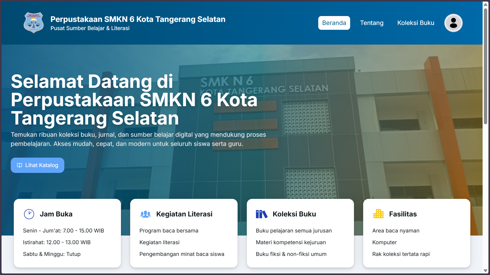
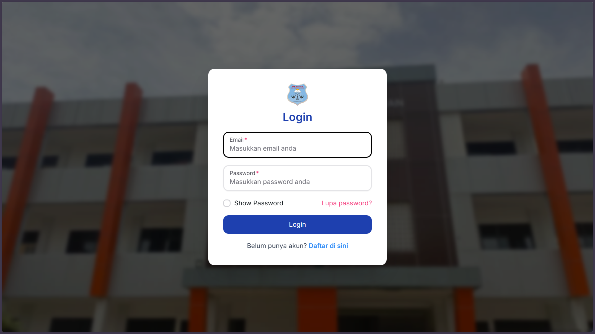
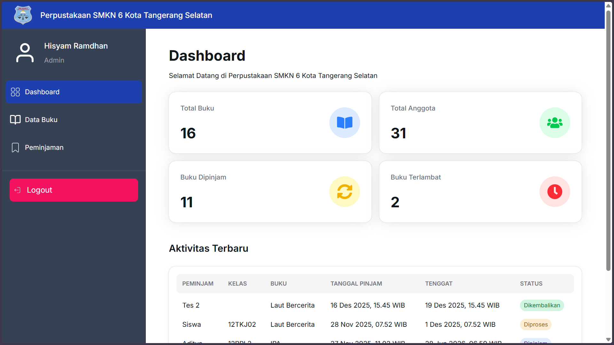
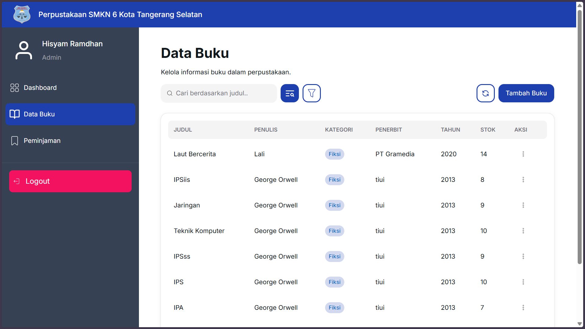
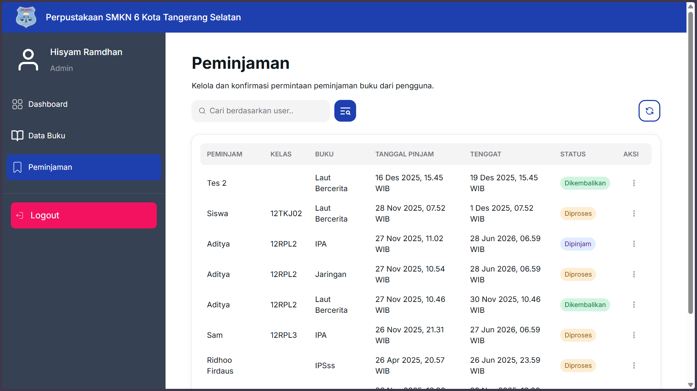

## 🚀 Overview

Proyek ini bertujuan untuk mendigitalisasi proses administrasi perpustakaan, mulai dari manajemen inventaris buku hingga pencatatan sirkulasi peminjaman.

Dikembangkan menggunakan modern web stack dengan fokus pada:

- Performa tinggi menggunakan Next.js (App Router)
- Type-safe data handling dengan TypeScript
- Efficient data fetching & caching
- Clean UI dan optimal user experience

---

## ✨ Fitur Utama

### - Manajemen Inventaris

- CRUD (Create, Read, Update, Delete) data buku
- Pengelolaan data buku secara terstruktur

### - Sistem Peminjaman

- Peminjaman dan pengembalian buku
- Tracking status buku secara real-time

### - Dashboard Statistik

- Ringkasan jumlah buku
- Status peminjaman
- Monitoring aktivitas perpustakaan

### - Pencarian & Filtering

- Pencarian buku berdasarkan judul
- Filter berdasarkan kategori

### - Authentication System

- Login & session management menggunakan NextAuth
- Proteksi halaman berdasarkan user/session

### - Responsive Design

- Optimal untuk desktop dan mobile
- UI modern dan reusable components

---

## 🛠️ Tech Stack

### - Library & Framework JS

- **React JS 19** — Frontend Library
- **Next JS 15** — React Framework (App Router)

### - UI & Styling

- **Tailwind CSS** — Utility-first CSS
- **Next UI / Hero UI** — Component Library

### - Data Fetching

- **TanStack React Query** — Server state management & caching
- **Axios** — HTTP client

### - Form & Validation

- **React Hook Form** — Form handling
- **Yup** — Schema validation

### - Authentication

- **NextAuth.js** — Authentication & session management

---

## 📑 Status Hukum & Sertifikasi

Proyek ini merupakan bagian dari program PKM yang telah diakui secara hukum:

- 📌 **Jenis Karya**: Program Komputer
- 📌 **Status**: Terdaftar di Direktorat Jenderal Kekayaan Intelektual (DJKI)
- 📌 **Peran**: Lead Frontend Developer

---

## ⚙️ Instalasi

### 1. Clone repository

```bash
git clone https://github.com/hisyamsz/fe-perpustakaan.git
```

## 📸 Screenshots

### - Home Page



### - Login Page



### - Dashboard



### - List Buku



### - List Peminjaman


